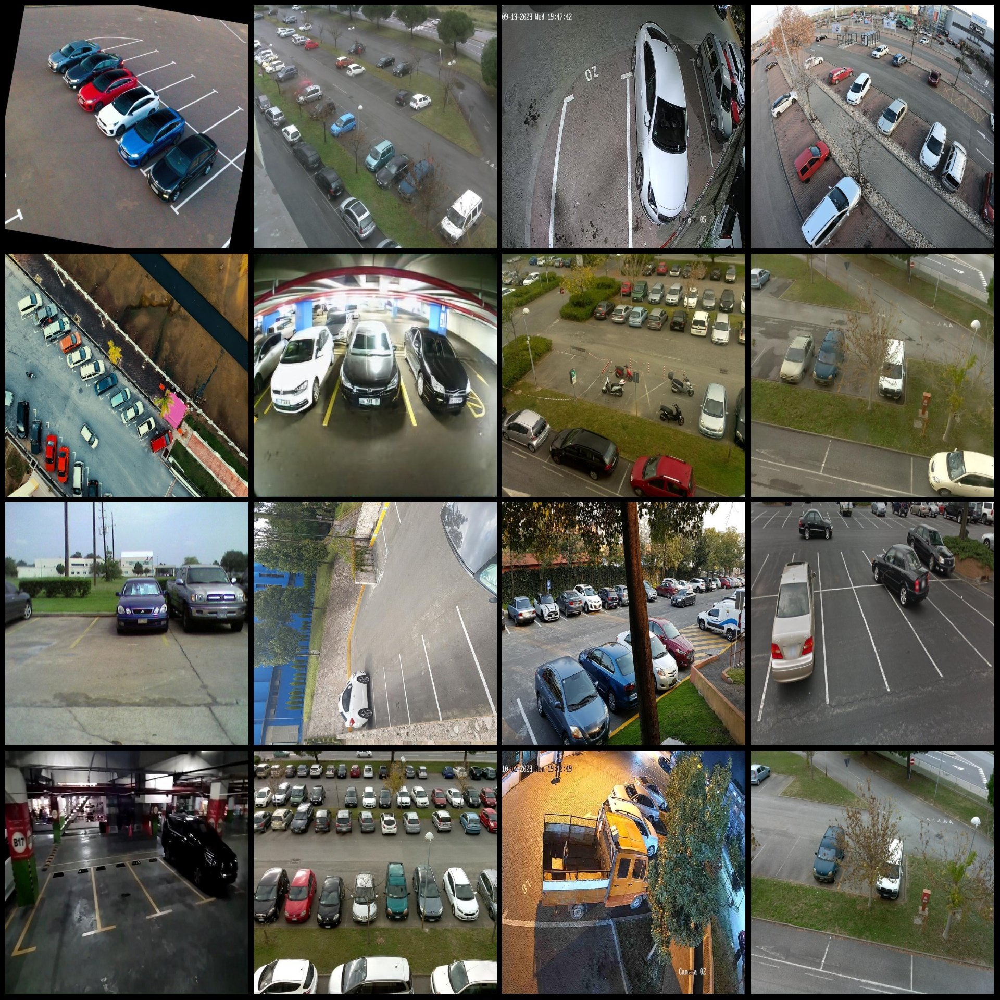
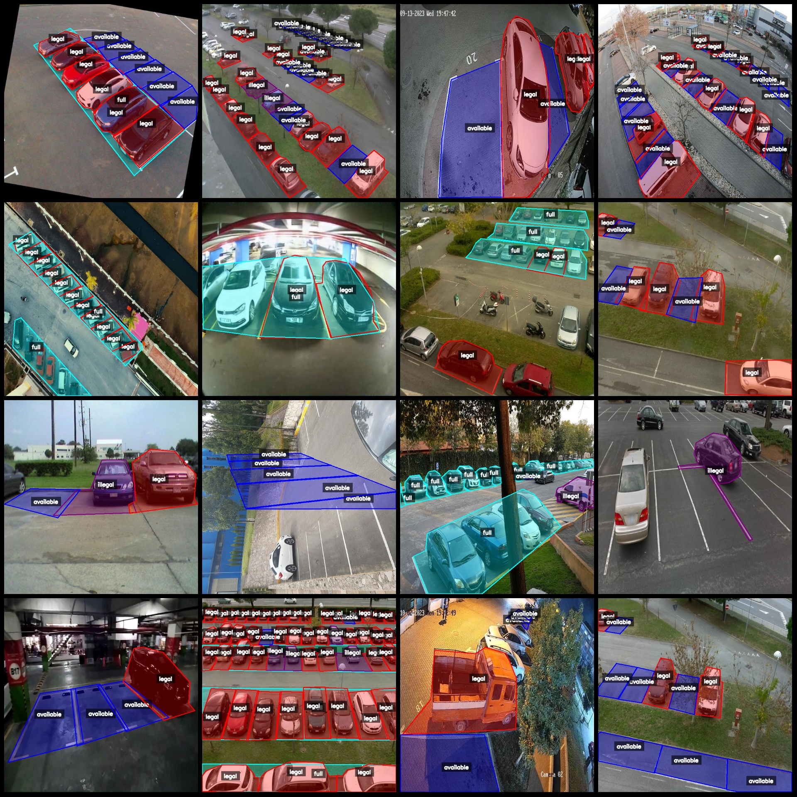
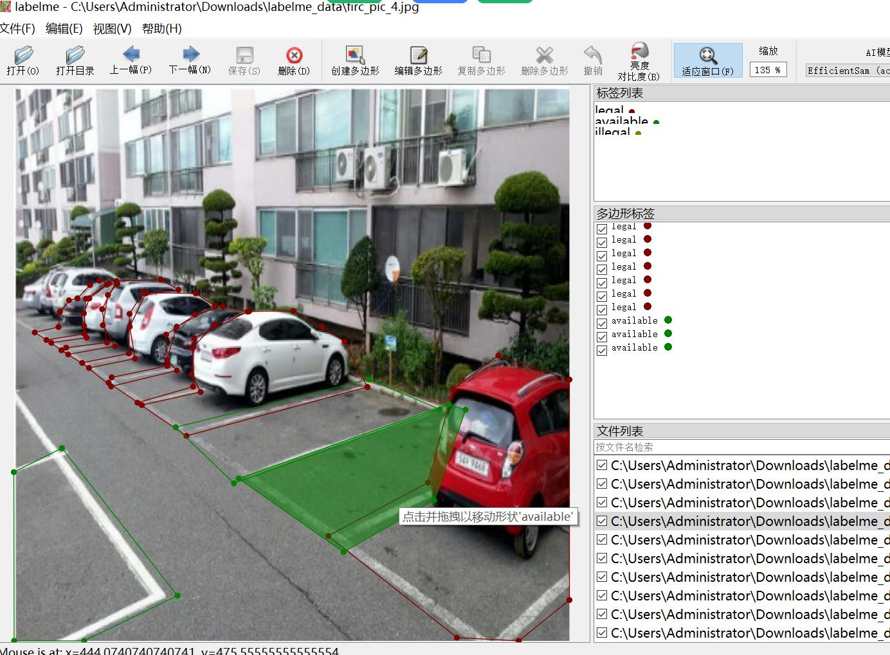

# Smart Parking Spot Conformity Management and Segmentation Data Set in LabelMe Format with 2082 Images in 4 Categories

Dataset Format: LabelMe format (without mask files, only containing jpg images and corresponding json files)
Number of Image Files (Total JPG Files): 2082
Number of Annotations (Total JSON Files): 2082
Number of Annotation Categories: 4
Annotation Category Names: ["available", "full", "illegal", "legal"]
Number of Boxes per Category:
- Available (Available): Count = 11018
- Full (Full): Count = 1403
- Illegal (Illegal): Count = 1589
- Legal (Legal): Count = 9157
Total Boxes: 23167

Using Annotation Tool: labelme=5.5.0
Image Resolution: 640x640
Annotation Rules: Polygon is drawn around the category

Important Notice: The dataset can be opened and edited using LabelMe. The json dataset needs to be converted into either Yolo or COCO format for instance segmentation or semantic segmentation.
Special Disclaimer: This dataset does not guarantee the accuracy of the trained model or weight files.

Image Preview:

Annotation Examples:
Original Images (Randomly selected 16 Images):
Annotation Drawing Results:
LabelMe Edited Image Example:

## Images

Here is a pay link on Stripe ( https://buy.stripe.com/3cs8yP7sY87d0vu9AB ). Please contact me lonlonago@foxmail.com after funding $89, and I will send you a complete data files , thank you!

